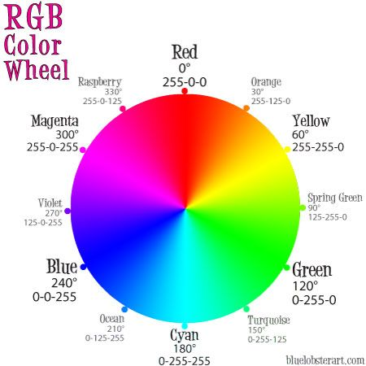

# Was ist ein Pixel
Pixel stellen die Rohinformation eines Bildes dar. Jedes Bild besteht aus einer Sammlung von Bildern. In Bildern stellt das Pixel die kleinste Informationseinheit dar. 
Der Informationsgehalt eines Pixels besteht aus den Farbwerten. Üblicherweise werden die Farbwerte in der Form von RGB (Rot, Grün, Blau).
Die Betrachtung der unterschiedlichen Farbräumen erfolgt in der entpsrechenden Lektion.

Dieses Bild weist eine Breite von 600 und eine Höhe von 739 Pixeln, dies ergibt eine Auflösung von 600 x 739 = 443400 Pixeln. 
Oft werden die Pixel in zwei Arten von Informationsgehalt unterschieden: Grautöne und Farben.
In einem Graustufenbild ist jedem Pixel ein Wert zwischen 0 und 255 zugeordnet.
Dabei entspricht der Wert 0 der Farbe Schwarz, der Wert 255 Weiss.
Die Werte zwischen 0 und 255 verändern die Intensität von Grau,
wobei Werte näher zu 0 dunkler als Wert näher zu 255 sind.

Der Graustufengradient zeigt wie dunkle Pixel näher am Wert 0, helle Pixel näher am Wert 255 angeordnet sind.
Farbpixel werden normalerweise im RGB Farbraum dargestellt.
Das Tupel bestehend aus den drei Bytes Rot, Grün und Blau repräsentiert die entsprechende Farbe.

Es existieren auch andere Farbräume, zu Beginn wird der Fokus auf den RGB Farbraum gesetzt. 
Jeder der drei Farben (Rot, Grün, Blau) wird durch einen Integer in einem Bereich zwischen 0 und 255 repräsentiert.
Der Wert gibt die Intensität der entsprechenden Farbe an. Normalerweise wird für die Darstellung des Farbwertes ein
8-Bit unsigned Integer verwendet. 
Die Kombination des RGB Tuple in der Form (Rot, Grün, Blau) repräsentiert die Farbe des Pixels. 
Die Farbe Weiss wird durch das Tuple (255, 255, 255) abgebildet. 
Die Farbe Schwarz wird durch das Tuple (0, 0, 0) abgebildet. Der Farbe Schwarz fehlt somit jeglicher Farbwert.

Das RGB-Farbrad verdeutlicht das Konzept der RGB Farbgestaltung

Einige Farben mit den entsprechenden RGB Zuordnungen:
* Schwarz: (0, 0, 0)
* Weiss: (255, 255, 255)
* Rot: (255, 0, 0)
* Grün: (0, 255, 0)
* Bl/au: (0, 0, 255)
* Navyblau: (0, 0, 128)
* Violet: (128, 0, 128)
* Gelb: (255, 255, 0)

