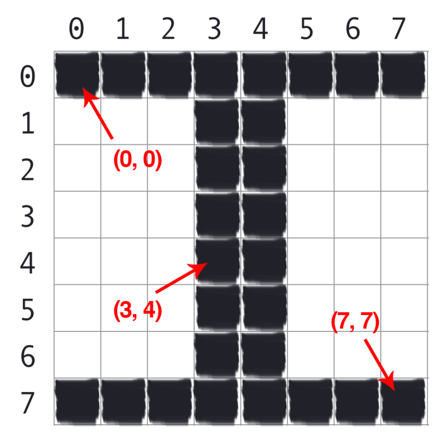

# Koordinatensystem
In Bildern wird ein Koordinatensystem verwendet, welches die Nullkoordinate oben links ansetzt.
Da keine absolut negativen Pixelkoordinaten erlaubt sind, wird auf der x-Achse nach rechts positiv gezählt.
Im Gegensatz zum mathematischen Koordinatensystem verläuft die positive Zählrichtung auf der
y-Achse nach unten gerichtet.

Die Abbildung verdeutlicht diesen Zusammenhang.

Der Punkt (0, 0) korespondiert mit dem Pixel oben links, der Punkt (7, 7) mit dem Pixel unten rechts.
