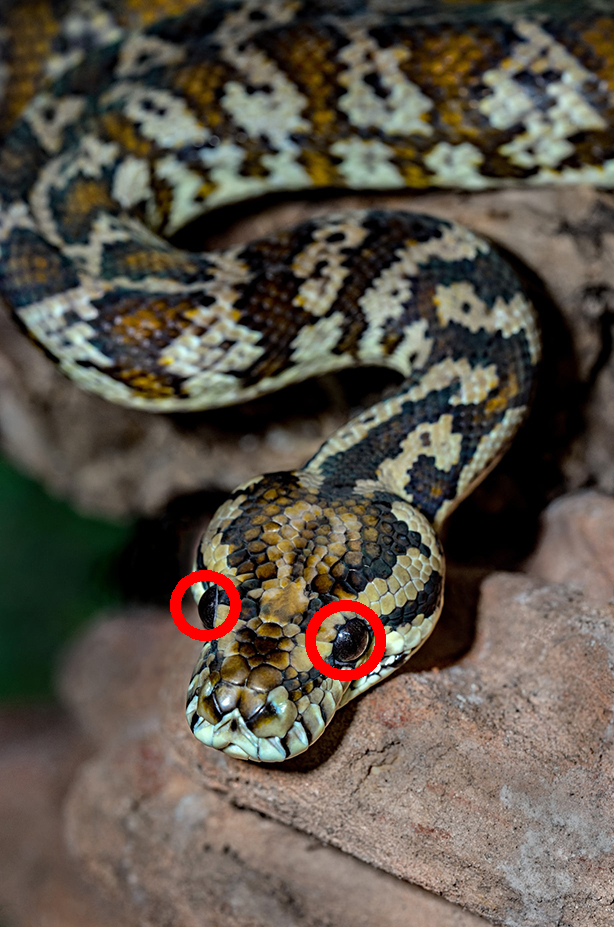

# Übung Zeichnen
Zeichnen Sie der in der Datei img/python_snake.jpg einen roten Kreis um beide Augen.

Das manipulierte Bild ist als png mit dem Namen python_snake_red_eyes.png im Ordner img abzuspeichern.
