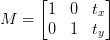

# Translation
Translation ist die Bewegung auf der x und y Achse eines Bildes. Links, rechts, auf und ab stellen die
vier möglichen Orientierungen dar. 

Mathematisch erfolgt diese Bewegung in der Form einer Translationsmatrix  


Wie eingans erwähnt, bevorzugen wir wir einen praxisorientierten Weg in der Umsetzung. Auf der Basis
der Bibliothek [`imutils`](https://pypi.org/project/imutils/) wird die Mathematik ausgelagert und
in der Form einer Funktion zur Verfügung gestellt.

```python
import cv2
import imutils
# lade Bild von der Datei in ein NumPy Array
image = cv2.imread('img/box_with_bullets.png')
# verschiebe das Bild um 150 Pixel nach rechts und 50 nach unten
shifted = imutils.translate(image, 150, 50)
```