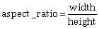

# Grössenänderung
Grössenänderung oder Skalierung ist der Prozess der Sreckung oder Staucheung
eines Bildes in der Breite und oder der Höhe.
Bei einer Grössenänderung eines Bildes ist die Verhältniszahl zentral für die Art und Weise
der Darstellung

