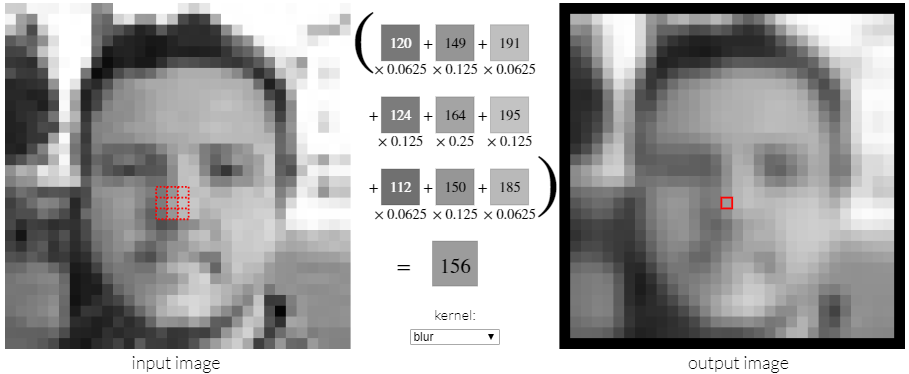

# Kernelfunktionen, Einleitung
Ein Bild kann als grosse Matrix betrachtet werden, dann können wir einen Kernel als
kleine Submatrix oder Faltungsmatrix betrachten. 

Die mathematischen Operationen weise starke Ähnlichkeiten zu denjenigen welche in der
Fouriertransformation verwendet wurden. Die schrittweise, iterative Faltung von der Bildmatrix
mit der Kernelmatrix eröffnet interessante Möglichkeiten.

## Visuelle Betrachtung der Faltung an Bildern
Die Website [https://setosa.io/ev/image-kernels/](https://setosa.io/ev/image-kernels/)
zeigt in einer grafischen Art und Weise unterschiedliche Faltungsalgorithmus für Bilder auf.  

Empfehlenswert ist die Dokumentation der Faltungsmtrix aus dem Gimp Projekt:  
[https://docs.gimp.org/2.6/de/plug-in-convmatrix.html](https://docs.gimp.org/2.6/de/plug-in-convmatrix.html)

## Zusammenfassung der Idee von Kernelfunktionen
Mit Kernelfunktionen kann man den Wert eines Pixels nach einem bestimmten Muster verändern. 
Der neue Wert berechnet sich als gewichteter Mittelwert aus den umliegenden Pixeln. 

Je nach dem wie man die einzelnen Pixel gewichtet, hat deren Wert einen kleineren oder grösseren Einfluss auf den ursprünglichen Farbwert. 
Addiert man alle Werte, wird der neue Wert damit grösser oder kleiner.

Durch die Anwendung von Kernelfunktionen lassen sich z.B. 
Details im Bild verstärken oder  verwischen.
