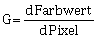

# Gradienten (Bildgradienten)
Die Bildgradienten stellen eine weitere elementare Eigenschaft in der Bildverarbeitung dar. Als 
Hauptanwendung kann die Kantendetektion betrachtet werden. Wie der Name schon sagt, entspricht die 
Kantendetektion der Suche nach Kanten in Bildern. Kanten definieren sich durch eine grössere
Farbwertänderung in benachbarten Pixeln.  

[OpenCV Python Tutorial: Image Gradients](https://opencv-python-tutroals.readthedocs.io/en/latest/py_tutorials/py_imgproc/py_gradients/py_gradients.html#gradients)
