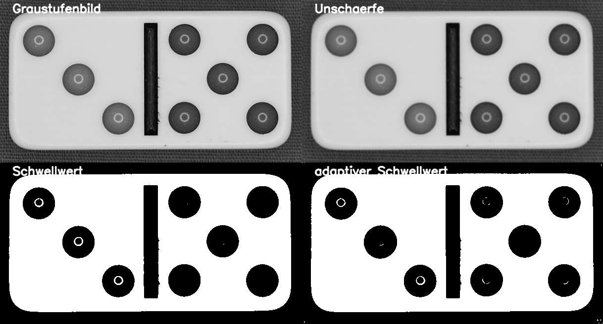

# TA3 Schwellwertbetrachtung

## Aufgabe
Umwandlung des Graustufenbildes in ein Binärbild in welchem die Konturen klar ersichtlich sind.

## Hintergrundinformationen
Die Schwellwertbetrachtung wandelt ein Graustufenbild ein ein binäres Bild aus Nullen und Einsen um.
Mit dem Ziel der Konturenselektion ist es notwendig, das Ausgangsbild mit klar definierten Übergangen 
im Bereiche der Konturen aufzubereiten. Die beiden in diesem Kurs vorgestellten Algorithmen:

- OpenCV `cv2.threshold()`
- scikit-image `threshold_local`  

unterscheiden sich dadurch, dass der `cv2.threshold()` Algorithmus manuell ermittelte Parameter benötigt.
Beim Algorithmus `threshold_local` erfogt die Ermittlung des Schwellwertes über einen Automaten. Wie bei
jedem Automatismus, ist eine gewisse Fehleranfälligkeit zu verzeichnen. In Abhängigkeit der Aufgabenstellung  
sind die gelieferten Resutate zu bewerten.

## Lösungsvorgehen
- OpenCV `cv2.threshold()`
- scikit-image `threshold_local`

