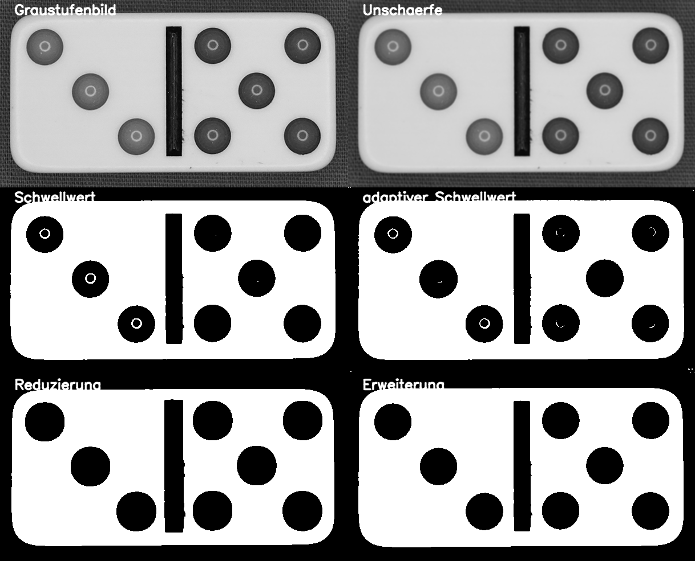

# TA4 Morphologische Operationen

## Aufgabe
Aus dem Bild ist das Pixelrauschen zu entfernen sowie die weissen Bereiche innerhalb der
Punkte im Dominostein.

## Hintergrundinformationen
Die Morpologischen Operationen vergrössern oder verkleiner Bereiche in Graustufen- und Binärbildern.

## Lösungsvorgehen
OpenCV stellt die beiden Funktionen `cv2.erode` und `cv2.dilate` für die morphologischen Operationen zur 
Verfügung.

