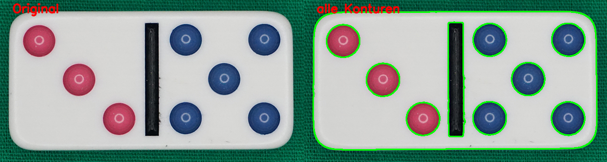

# TA5a Konturenselektion aller Konturen

## Aufgabe
Es sind sämtliche Konturen zu erfassen.

## Hintergrundinformationen
Mit der Konturenerfassung steht ein Werkzeug zur Verfügung, welches es erlaubt Objekte in
einem Bild zu isolieren. Die Objektisolation ist insbesondere im Bereiche der industriellen Automation
von grossem Interesse. Zum Beispiel werden oft Roboter in Abhängikgeit der Objektkoordinaten auf
auf die geforderten Positionen bewegt.

## Lösungsvorgehen
OpenCV stellt die Funktion `cv2.findContours` zur Verfügung.

