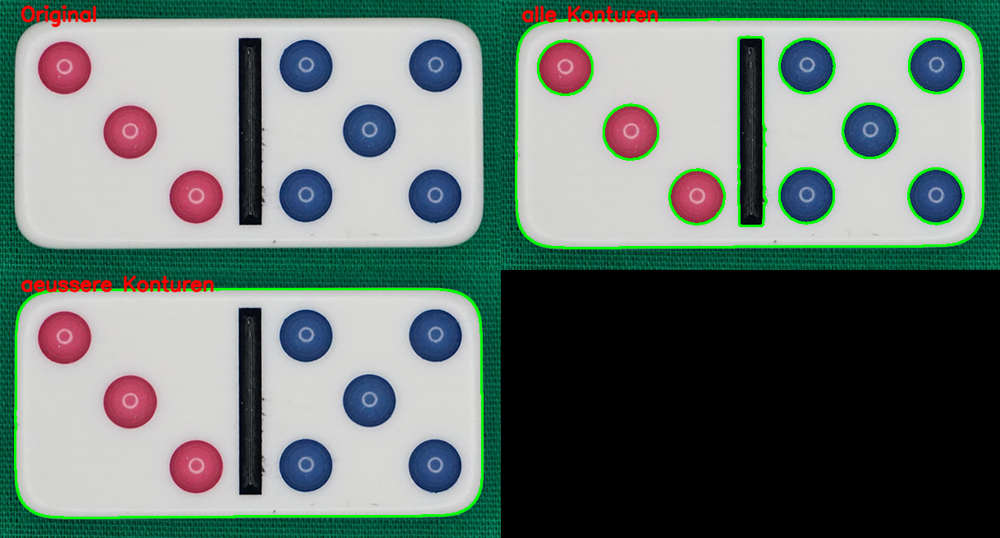

# TA5b Konturenselektion der äusseren Kontur

## Aufgabe
Es ist die äussere Kontur zu betrachten.

## Hintergrundinformationen
Für die Extraktion der äusseren Konturen ist der Parameter `cv2.RETR_EXTERNAL` der 
Konturenfunktion zu übergeben.

## Lösungsvorgehen
OpenCV stellt die Funktion `cv2.findContours` zur Verfügung.

