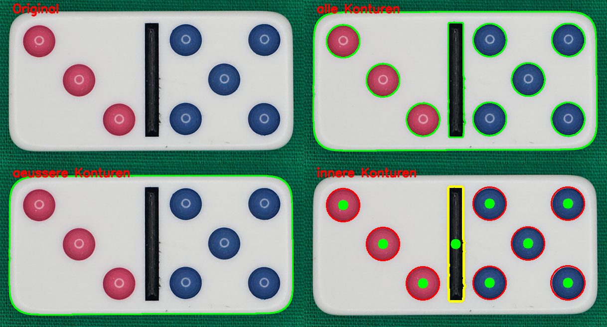

# TA5c Konturenselektion der inneren Konturen

## Aufgabe
Es sind die inneren Konturen zu erfassen. Aus den Kontureneigenschaften sind die Punkte und
der Querbalken zu extrahieren. Über die Bestimmung des Massepunktes, kann das Zentrum des
jeweiligen Objektes ermittelt werden. 

## Hintergrundinformationen
Die Konturenhirarchie ermöglicht die hirarchische Betrachtung der Konturen.
Weitere Informationen sind der OpenCV Dokumentation zu entnehmen:  
[Konturenhirarchie](https://docs.opencv.org/4.2.0/d9/d8b/tutorial_py_contours_hierarchy.html)

## Lösungsvorgehen
OpenCV stellt die Funktion `cv2.findContours` zur Verfügung.

