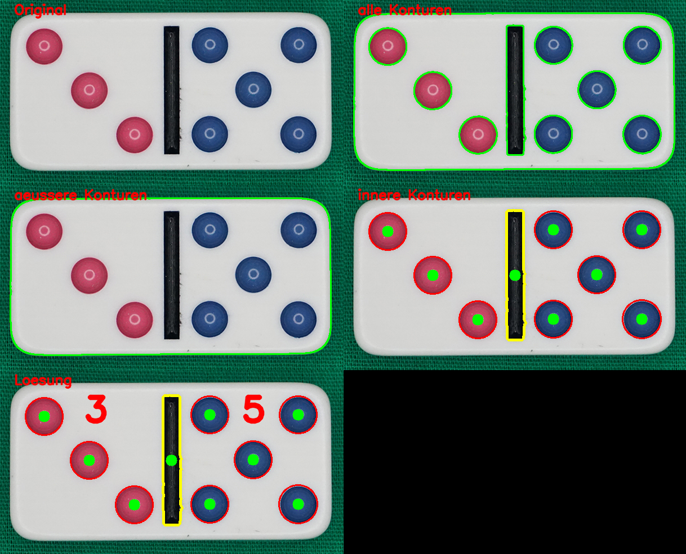

# TA6 Punkte zählen

## Aufgabe
Als Abschluss können nun die Punkte gezählt werden.

## Hintergrundinformationen
Nach der Erfassung der inneren Konturen,
erfolgt die Unterscheidung zwischen Punkt und Querbalken über die Auswertung der Fläche. Die
Unterscheidung zwischen der linken und der rechten Seite kann über den Massepunkt des Querbalkens.
  
Hinweis: Dieser Strategie funktioniert nur solange, wie der Dominostein waagrecht oder senkrecht
erfasst wird. Ist dies nicht der Fall, ist mit den Boundingboxen die Winkellage zu ermitteln und
die Koordinaten entsprechend umzurechnen. 

Die Konturenhirarchie ermöglicht die hirarchische Betrachtung der Konturen.
Weitere Informationen sind der OpenCV Dokumentation zu entnehmen:  
[Konturen in OpenCV](https://docs.opencv.org/4.2.0/d3/d05/tutorial_py_table_of_contents_contours.html)

## Lösungsvorgehen
OpenCV stellt die Funktion `cv2.findContours` zur Verfügung.

