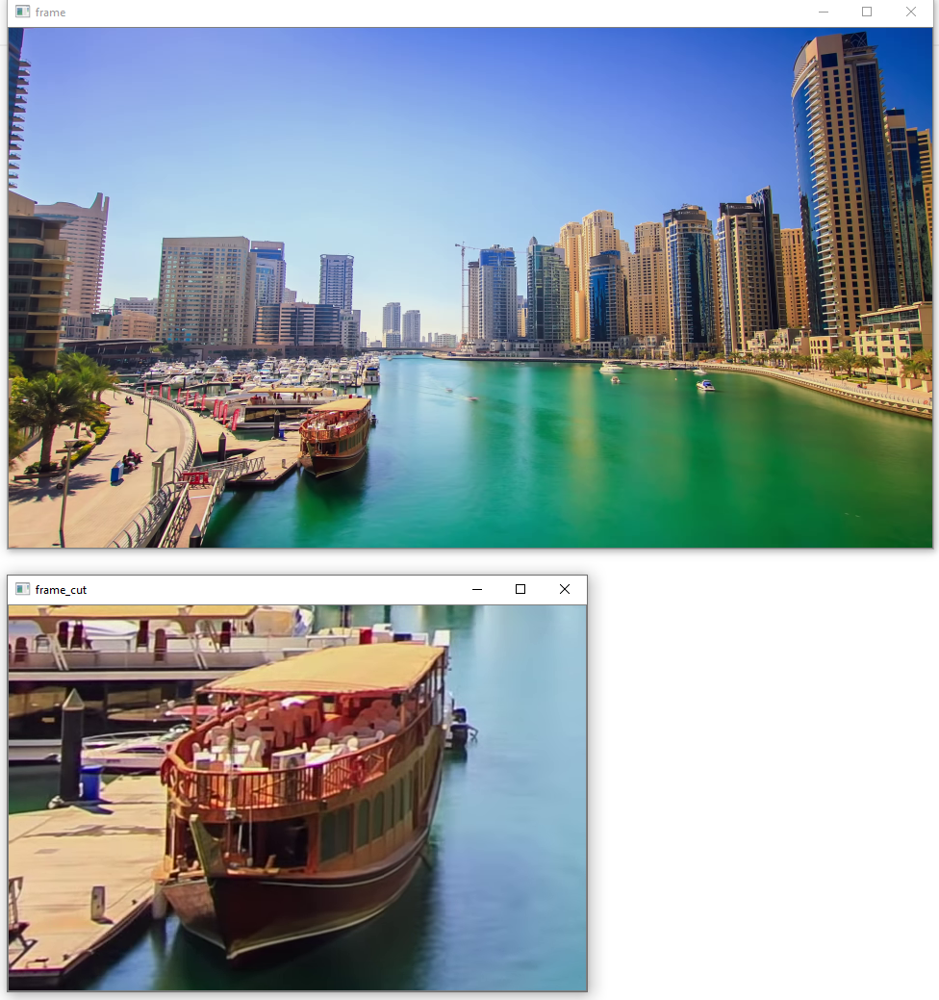

# Videobearbeitung

## Aufgabe
1. Ein 2160p (4k) Video ist auf qHD (960 x 540) zu skalieren.
2. Der Ausschnitt mit dem Boot auf der linken unteren Seite ist aus dem 2160p Video als eigenständiges Video zu
   extrahieren. 

## Lösungsvorgehen
1. Einlesen des Originalvideos
2. Instanzierung der VideoWriter-Klasse
3. imutils.resize auf die Breite 960
4. Ausschneiden des Bootes mit NumPy Arrayoperationen aus dem Originalvideo

[Videodemo Videobearbeitung](https://web.microsoftstream.com/video/9b827fb6-049f-4a9c-95f5-0384926ef02a)

