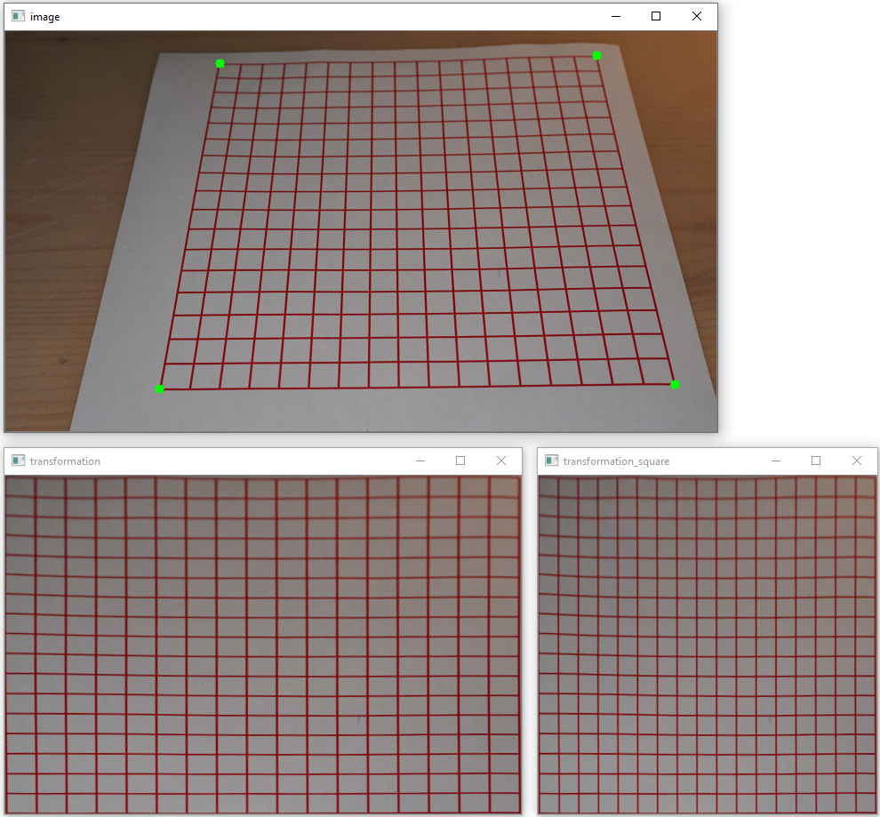

# Perspektivenkorrektur

## Aufgabe
Ein verzerrtes Bild ist in der Perspektive zu korrigieren.  

Hinweis: Das Original ist hinterlegt in `pdf/grid.pdf`

## Lösungsvorgehen
1. Einlesen des Originalbildes
2. Manuelle Bestimmung der 4 Eckpunkte (`perspective_correction_1.py`)
3. Transformation der 4 Eckpunkte zu einem neuen Bild mit `cv2.warpPerspective`
4. Grössenänderung durch stauchen und strecken des transformierten Bildes in ein quadratischen Format
5. Bestimmung der metrischen Distanz pro Pixel

