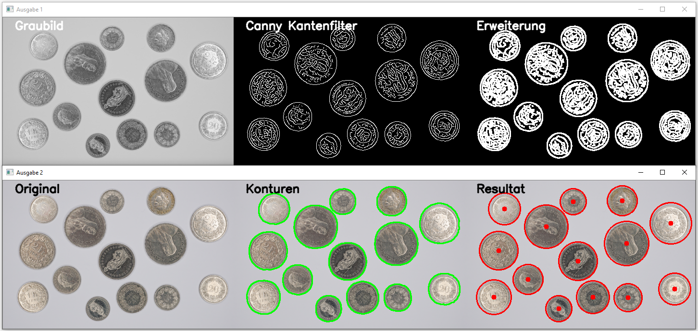

# Kantendetektor

## Aufgabe
In einem Bild sind die einzelnen Münzen mittels Kantendetektion zu extrahieren.

## Lösungsvorgehen
1. Einlesen des Originalbildes
2. Unschärfe (Blur)
3. Canny Kantendetektor
4. Morphologische Operationen
5. Konturenoperationen
6. Ausgabe des bearbeiteten Bildes

