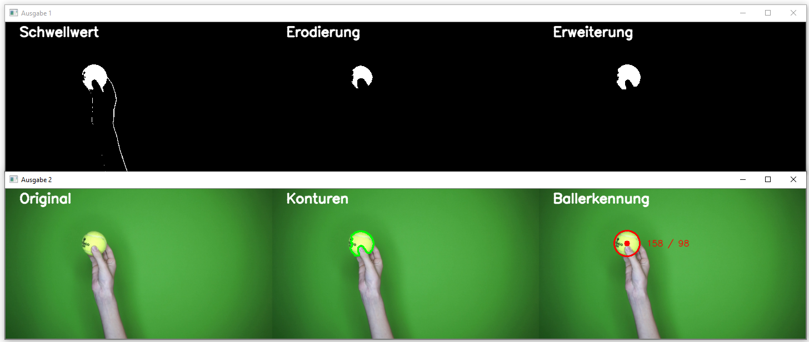

# Objektfolger

# Aufgabe
In einem Video soll der gelbe Tennisball detektiert werden und im Video die Koordinaten des
Massenpunktes eingebendet werden.

## Lösungsvorgehen
1. Einlesen des Originalvideos
2. Farbextrahierung und Maskierung
3. Unschärfe (Blur)
4. Morphologische Operationen
5. Konturenoperationen
6. Ausgabe des bearbeiteten Videobildes

[Videodemo Objektfolger](https://web.microsoftstream.com/video/0ede9251-68b9-481a-9aa2-62d926ce7737)

